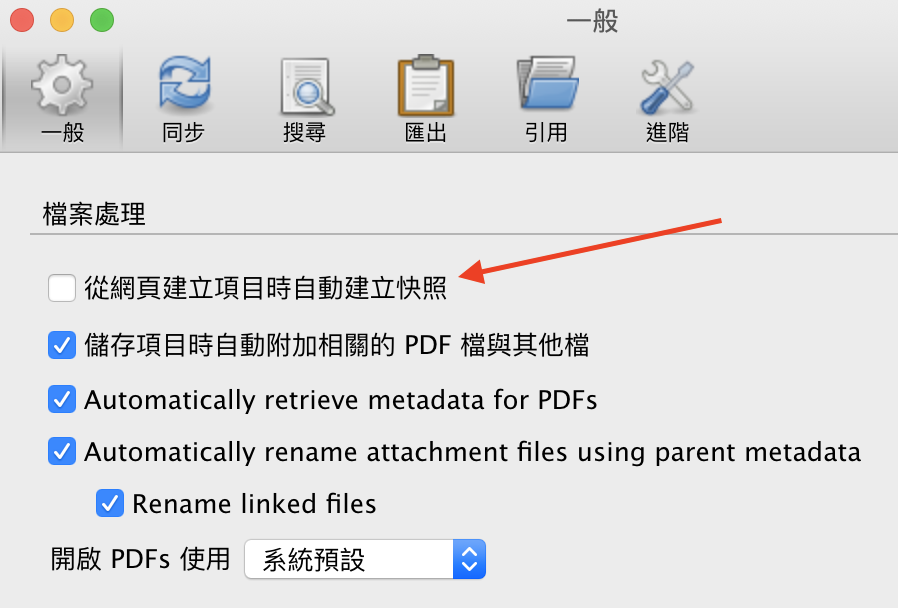
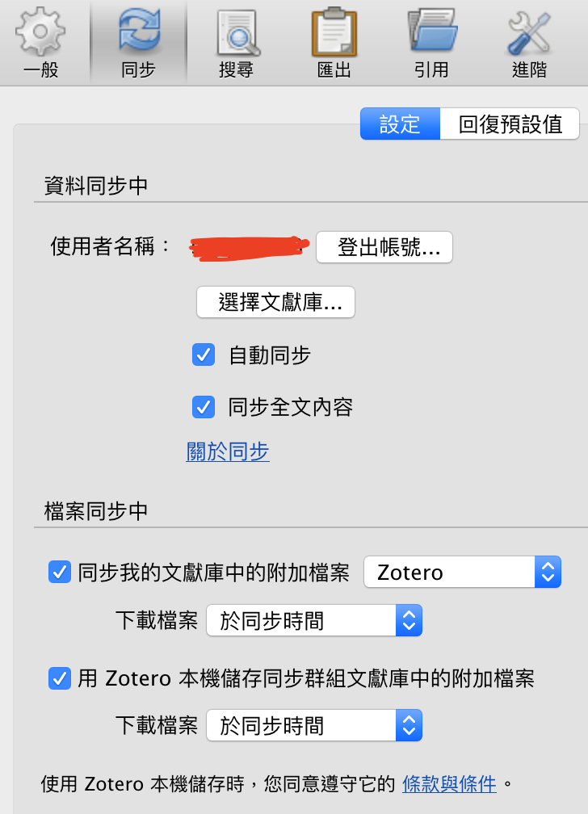
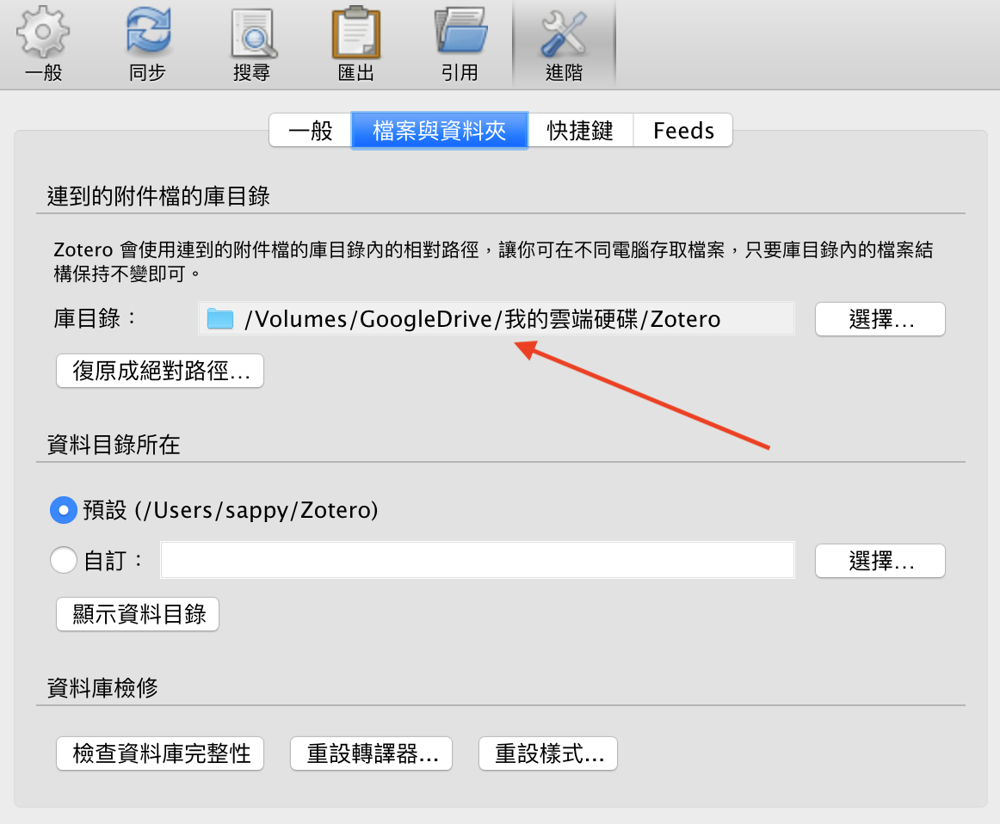
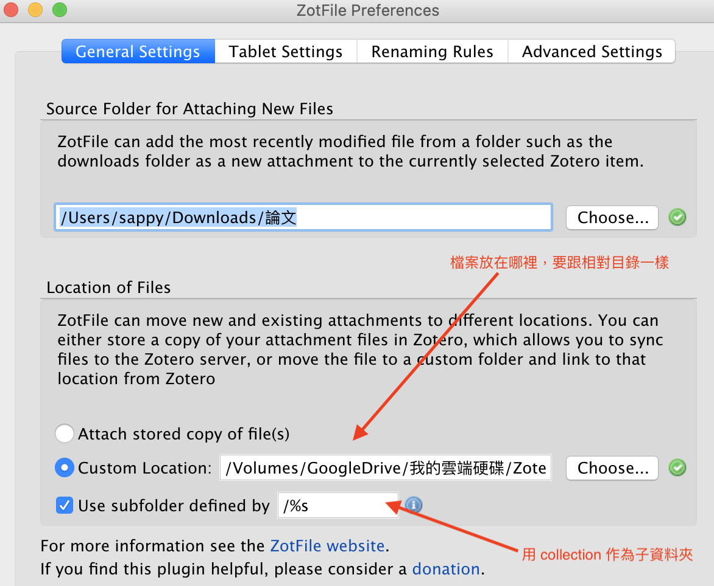
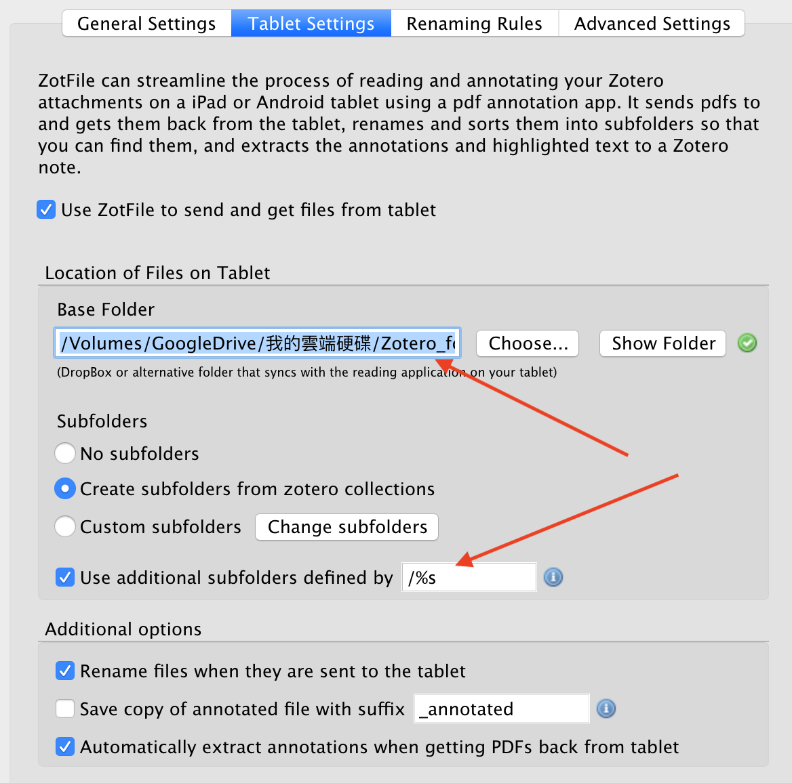
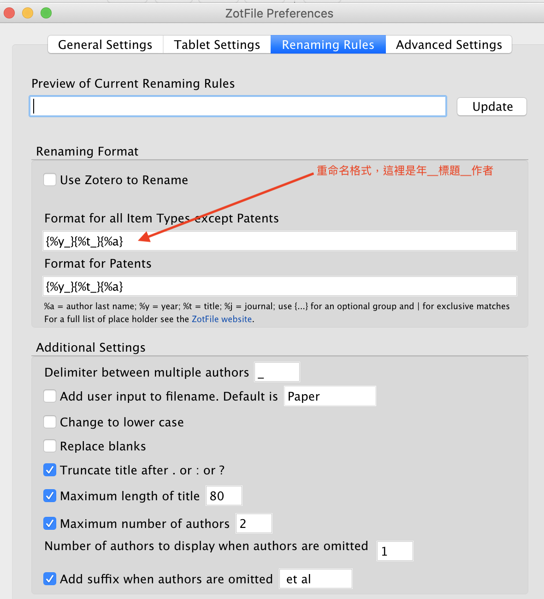

# 文獻管理軟體比較
比較的時間以 2020/1/1 ~ 2020/1/5 的版本為主  

# 前言  
開始了研究生的生活後，陸陸續續使用了不同方法來管理文獻，但還是希望能穩定在一個軟體上，省去手動的步驟。  
經過了一段時間的比較後，終於誕生了這篇文章。  

# 需求簡介
1. 標註必須附著在 pdf 上 - 由於我本身喜歡在 pdf 上做註記，也希望未來若要更換軟體時能方便地把我的資料帶走，而我的筆記就應當是我的筆記，不能被鎖死在特定格式上  
2. 取用文獻方便且正確（特別是在 arXiv 上的） - 由於我的領域很多時候會在 arXiv 上看到論文，因此要能夠正確的解析 arXiv 上的文獻，獲得正確的引用資訊外，也必須足夠方便把文獻放入管理軟體中，最好能一鍵解決  
3. 跨平台 - 由於我習慣用 ipad 來閱讀論文，用 pc or mac 寫作，因此至少要能跨這三個平台  
4. 便宜 - 因為我很窮ＱＡＱ
5. 可用偏好的 pdf 閱讀器閱讀及編輯 - 因為學校有提供 adobe pdf，而有些軟體內建的不是很好用

# 開始比較
## 參賽選手
1. [Mendeley](https://www.mendeley.com) - 之前使用的軟體
2. [Zotero](https://www.zotero.org/) - 本次冠軍
3. [Endnote x9](https://endnote.com/) - 老牌管理軟體
4. [Citavi 6](https://www.citavi.com/en) - 功能強大
5. [ReadCube](https://www.readcube.com/home) - 管理軟體新銳

## 第一輪淘汰
1. Citavi 6 - 沒有跨平台
2. Endnote x9 - 對 arXiv 支援不好
3. ReadCube - 對 arXiv 支援不好 + 無法註記在 pdf 上

## 第二輪比較
### Mendeley
#### 優點
1. 龐大社群
2. 優秀的論文推薦功能
3. 對 arXiv 支援超好
4. 跨平台

#### 缺點
1. 不能直接標記在 pdf 上
2. 搜尋時，相同論文會出現多篇，引用、被引用次數不精確（跟 google scholar 相比）
3. 貴(相比 Zotero)

### Zotero
#### 優點
1. 開源
2. 支持 plugin
3. 便宜（搭配 zotfile 服用）
4. 可直接標註在 pdf 上
5. 可自訂 pdf 檔名（zotfile）

#### 缺點
1. 對 arXiv 支援不佳（相比 Mendeley）
2. 沒有論文推薦功能
3. 不跨平台（ipad）

# 結論
最終還是選定 Zotero + Zotfile 搭配服用
下面來說明一下我的設定

# Zotero 設定
1. 安裝 [Zotfile](http://zotfile.com/)
2. 取消自動快照

3. 設定同步

4. 修改連結目錄成為相對目錄，這是最重要的步驟，在此目錄下的所有檔案都會變成相對目錄，因此在不同電腦上只要設定正確，就都能成功開啟檔案

5. 設定 Zotfile，告知要把檔案幫去哪裡，要跟上面的相對路徑一樣

6. 傳送到 ipad - 個人感覺不是很必要，因為這只是把檔案放到雲端硬碟上的資料夾而已，如果第五步驟已經把檔案放在雲端硬碟中，那這步驟就可以略過，不過假若將來檔案多起來，或許就能用這功能，減少在雲端硬碟中一個個慢慢找的時間

7. 命名規則，這步驟很重要，我是 年\_標題\_作者 `{%y_}{%t_}{%a}` 這樣命名，也要用 collection 作為子資料夾來分大類 `/%s`

